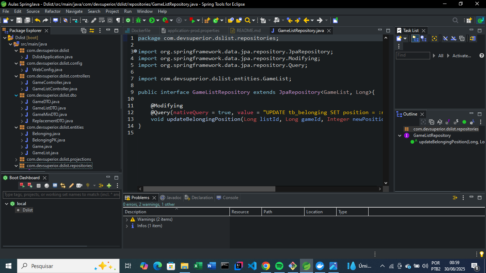
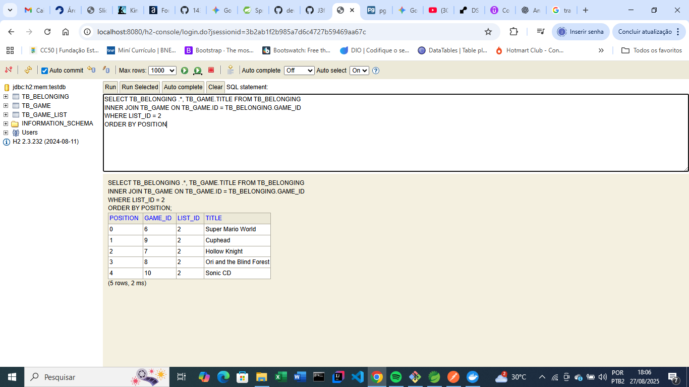
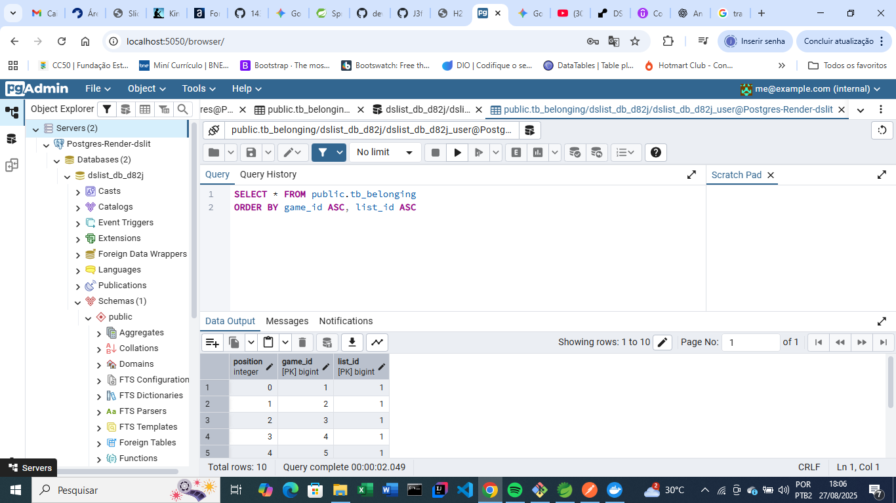
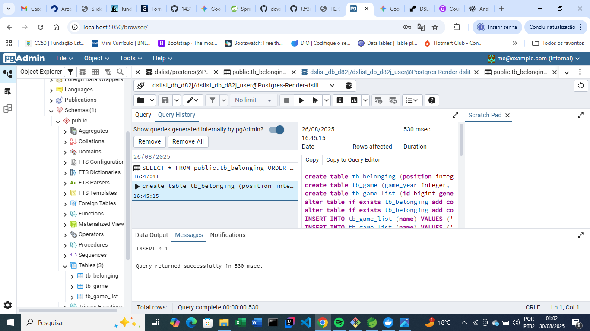
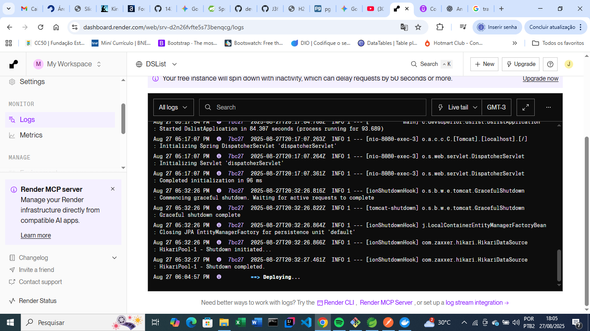
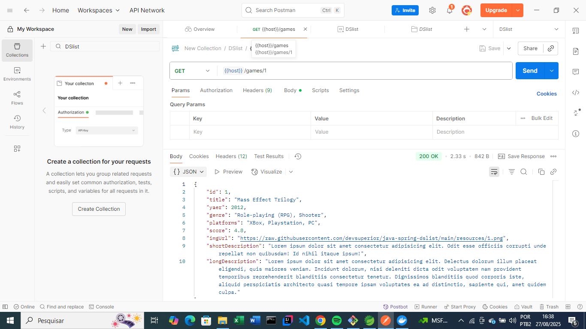

# DSList - Backend DevSuperior

  

## Sobre o Projeto

O DSList é um projeto backend desenvolvido em Java com o framework Spring Boot. Ele implementa uma API RESTful para gerenciar uma lista de games, com funcionalidades para listagem, busca por gênero e uma funcionalidade extra para reorganizar os jogos em uma lista.

Este projeto demonstra boas práticas de desenvolvimento backend, incluindo a separação de responsabilidades em camadas (Controller, Service, Repository), o uso de DTOs para comunicação e a persistência de dados com JPA e PostgreSQL. O deploy foi automatizado usando CI/CD com Docker e Render, mostrando familiaridade com ambientes de produção e infraestrutura como código.

## Tecnologias Utilizadas

* **Linguagem de Programação:** Java 21
* **Framework:** Spring Boot 3
* **Banco de Dados:** PostgreSQL (Local para desenvolvimento, Render para produção)
* **Persistência:** JPA / Hibernate
* **Build Tool:** Maven
* **APIs:** RESTful API
* **Containers:** Docker
* **Deploy:** Render (com CI/CD e Blueprint)
* **Ferramentas:** Postman, PgAdmin

## Arquitetura e Componentes

A arquitetura do projeto segue o padrão em camadas, garantindo um código limpo e de fácil manutenção:

* **Controller:** Recebe as requisições HTTP e delega a lógica para a camada de serviço.
* **Service:** Contém a lógica de negócio, orquestrando as operações e comunicando-se com a camada de acesso a dados.
* **Repository:** Responsável pela comunicação direta com o banco de dados.

A comunicação com o frontend é feita através de DTOs (Data Transfer Objects), que expõem apenas os dados necessários, protegendo a estrutura interna do banco de dados.

## Configuração CORS

Para permitir que a aplicação frontend (hospedada em um domínio diferente) possa se comunicar de forma segura com o backend, foi implementada uma configuração de CORS (Cross-Origin Resource Sharing). Esta configuração garante que as requisições do frontend não sejam bloqueadas pelo navegador do usuário. A implementação utiliza a anotação `@Configuration` do Spring para definir as origens permitidas dinamicamente através de uma variável de ambiente.

## Histórico de Desenvolvimento e Deploy

A seção a seguir documenta o processo de desenvolvimento e deploy, evidenciando o uso de ferramentas profissionais e a resolução de problemas de forma eficiente.

### 1. Ambiente Local e Testes Iniciais

Iniciamos o desenvolvimento com um banco de dados local H2, o que permitiu um ciclo rápido de codificação e testes. A validação das requisições e a integridade dos dados foram testadas e confirmadas via Postman e pela interface do H2 Database Console.

### 2. Conexão e Migração para o PostgreSQL na Nuvem

Para simular um ambiente de produção, foi criado um banco de dados PostgreSQL na plataforma Render. A conexão com o banco de dados remoto foi configurada no PgAdmin, permitindo a visualização da estrutura de dados. Em um primeiro momento, o banco estava vazio, refletindo a necessidade de migração.

### 3. População do Banco de Dados Remoto

A estrutura e os dados do banco de dados foram migrados do ambiente local para o Render. O script SQL de criação de tabelas e inserção de dados foi executado manualmente via **Query Tool** no PgAdmin.

### 4. Deploy com CI/CD

O deploy da aplicação foi automatizado usando **Docker** e o arquivo de configuração **`render.yaml`**, seguindo o princípio de CI/CD. Após a correção de erros de configuração (`invalid runtime`, `database does not exist`), a aplicação foi empacotada em uma imagem Docker e implantada com sucesso.

A validação final foi feita no Postman, onde uma requisição `GET` para o endpoint `/games` retornou a lista de jogos, confirmando que a aplicação está em pleno funcionamento e se comunicando corretamente com o banco de dados.

---

## Como Rodar o Projeto

Para executar o projeto em seu ambiente local, siga as instruções abaixo:

1.  Clone este repositório.
2.  Certifique-se de ter o Java 21 e o Maven instalados.
3.  Abra o projeto em sua IDE (IntelliJ, VS Code ou Eclipse).
4.  Configure as credenciais do seu banco de dados local no arquivo `application.properties`.
5.  Execute a classe principal `DslistApplication.java`.

## Contato

* **Jeferson de Souza Martins** - [https://www.linkedin.com/in/jeferson-martins-48b9b690/]

## Referência

* **Nélio Alves** - [https://github.com/devsuperior/dslist-backend]